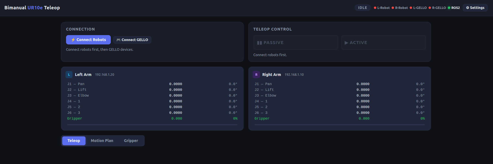
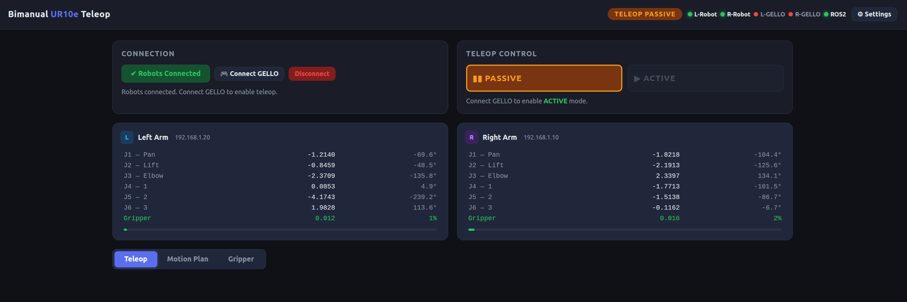
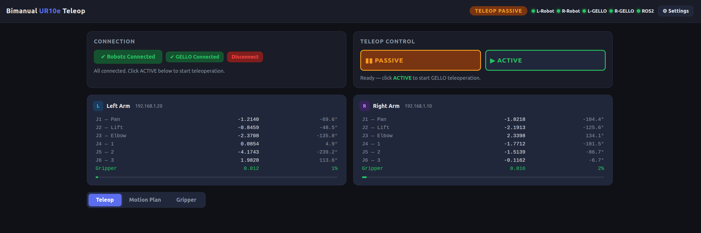
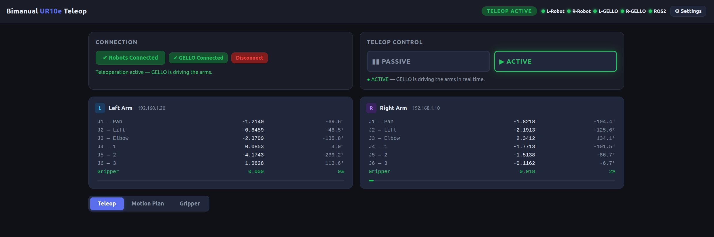
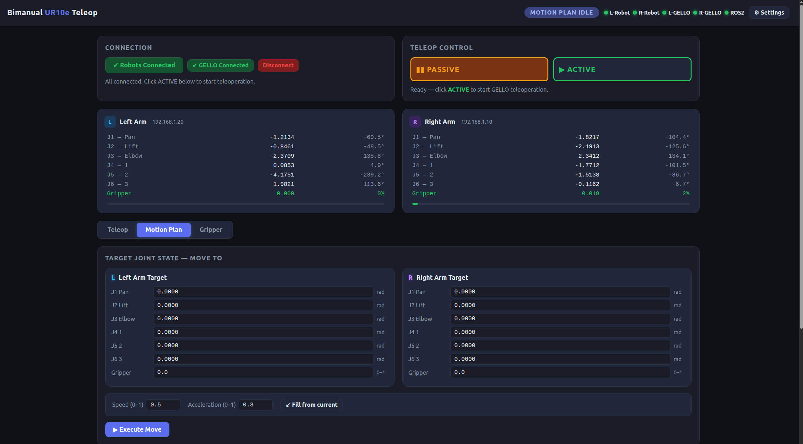
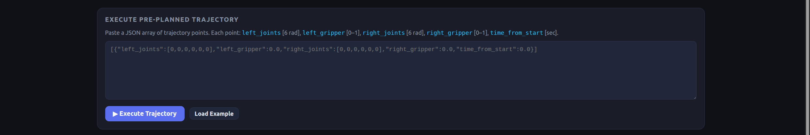

# Bimanual UR10e Teleop Interface

A browser-based teleoperation and motion planning interface for a bimanual UR10e setup with [GELLO](https://github.com/wuphilipp/gello_software) devices. No X11 or RViz required — everything runs in Docker and is controlled through a web browser.



---

## Hardware Setup

| Component | Detail |
|---|---|
| Left robot | UR10e at `192.168.1.20` |
| Right robot | UR10e at `192.168.1.10` |
| Left GELLO | USB serial — `/dev/serial/by-id/usb-FTDI_USB__-__Serial_Converter_FTAO5209-if00-port0` |
| Right GELLO | USB serial — `/dev/serial/by-id/usb-FTDI_USB__-__Serial_Converter_FTAO528D-if00-port0` |
| Grippers | Robotiq (socket, port 63352), normalized 0.0–1.0 |

The machine running Docker must be on the same network as the robots (`192.168.1.x`).

---

## Prerequisites

- Docker Engine ≥ 24 and Docker Compose plugin
- The host machine on the `192.168.1.x` subnet (or adjust IPs in Settings)
- GELLO devices plugged in via USB before starting the container

Install Docker on Ubuntu:

```bash
curl -fsSL https://get.docker.com | sh
sudo usermod -aG docker $USER   # log out and back in after this
```

---

## Installation

### 1. Clone the repository

```bash
git clone --recurse-submodules https://github.com/shalman-khan/bimanual-ur10e-teleop.git
cd bimanual-ur10e-teleop
```

> **Note:** `--recurse-submodules` pulls `gello_software` and `bimanual_ur10e` automatically.  
> If you forgot it: `git submodule update --init --recursive`

### 2. Build the Docker image

```bash
docker compose build
```

This installs all ROS 2 Humble packages, Python dependencies (FastAPI, ur-rtde, Dynamixel SDK), and builds the `bimanual_ur10e` ROS 2 workspace inside the image. First build takes ~5–10 minutes.

---

## Running

### Production (real robots)

```bash
docker compose up
```

Then open **http://localhost:8080** in **Google Chrome**.

### Mock mode (no hardware — for testing)

```bash
docker compose run --rm -e MOCK_ROBOTS=1 teleop server
```

Mock robots simulate sinusoidal joint motion so you can exercise the full UI without hardware.

### URSim offline simulation (simulated robots, no real hardware)

Runs two UR10e simulators alongside the teleop server on an isolated Docker network.
Use this to verify the full RTDE control path before connecting real hardware.

```bash
docker compose -f docker-compose.ursim.yml up --build
```

| URL | What it shows |
|---|---|
| http://localhost:6081/vnc.html | Left robot Polyscope (click Connect) |
| http://localhost:6082/vnc.html | Right robot Polyscope (click Connect) |
| http://localhost:8080 | Teleop Web UI |

**In Polyscope** (each robot): click **Confirm Safety Configuration** if prompted, then the **Move** tab (crosshair icon) to see the 3D arm view.

**In the Web UI**: Connect Robots → Connect GELLO (mock sinusoid) → Active. Both arms will move in Polyscope.

> The left simulator is at `172.30.0.20`, the right at `172.30.0.10` — matching the default real-robot IPs so no settings change is needed.

### Background / daemon mode

```bash
docker compose up -d          # start in background
docker compose logs -f        # follow logs
docker compose down           # stop
```

---

## Web UI Walkthrough

### Browser requirement

**Use Google Chrome.** Firefox has a known rendering issue where the main panel disappears after connecting robots. All other browsers are untested.

### Step 1 — Open the interface

Navigate to `http://localhost:8080` in **Google Chrome**. The interface starts in **IDLE** state with all connection indicators red.


---

### Step 2 — Connect robots

Click **Connect Robots**. The interface reaches out to both UR10e controllers via RTDE. On success the state changes to **TELEOP PASSIVE** and the L-Robot / R-Robot indicators turn green.



In **Teleop Passive** the robots hold their current joint positions. GELLO inputs are ignored.

---

### Step 3 — Connect GELLO devices (optional for teleoperation)

Click **Connect GELLO Devices**. The L-GELLO and R-GELLO indicators turn green once both Dynamixel chains are readable.



---

### Step 4 — Enable teleoperation

Click **Active** to enter **TELEOP ACTIVE**. GELLO joint positions are streamed to the robots at 50 Hz via `servoJ`. The live joint table updates in real time.



Click **Passive** at any time to freeze the arms while keeping them connected.

---

### Step 5 — Motion planning

Switch to the **Motion Plan** tab to move arms to a specific joint configuration.



**Move To Target** — enter target joint angles (degrees) for each arm and click **Execute Move**. Both arms move simultaneously via `moveJ` (UR's built-in joint-space planner — shortest path, no collision checking).

**Execute Trajectory** — paste a JSON array of waypoints. Each waypoint:

```json
[
  {
    "left_joints":     [0.0, -90.0, -90.0, -90.0, 90.0, 0.0],
    "left_gripper":    0.0,
    "right_joints":    [0.0, -90.0,  90.0, -90.0, -90.0, 0.0],
    "right_gripper":   0.0,
    "time_from_start": 0.0
  },
  {
    "left_joints":     [10.0, -85.0, -90.0, -90.0, 90.0, 0.0],
    "left_gripper":    0.5,
    "right_joints":    [-10.0, -85.0, 90.0, -90.0, -90.0, 0.0],
    "right_gripper":   0.5,
    "time_from_start": 2.0
  }
]
```

Joint values are in **degrees** in the UI; the server converts to radians before sending to the robot.



---

### Settings

Click the **Settings** gear icon to configure robot IPs, GELLO serial ports, GELLO Dynamixel calibration configs, and all control parameters (servoJ gain, moveJ speed/acceleration, control rate).

Settings are saved to a Docker volume (`teleop_settings`) and persist across container restarts.

---

## ROS 2 Interface

The container runs a ROS 2 Humble node alongside the web server.

### Published topics

| Topic | Type | Rate | Content |
|---|---|---|---|
| `/robot1/joint_states` | `sensor_msgs/JointState` | 50 Hz | Right arm joints (`robot1_shoulder_pan_joint` … `robot1_wrist_3_joint`) |
| `/robot2/joint_states` | `sensor_msgs/JointState` | 50 Hz | Left arm joints (`robot2_shoulder_pan_joint` … `robot2_wrist_3_joint`) |
| `/gripper1/joint_states` | `sensor_msgs/JointState` | 50 Hz | Right gripper (`gripper1_finger_joint`, 0.0 open → 1.0 closed) |
| `/gripper2/joint_states` | `sensor_msgs/JointState` | 50 Hz | Left gripper (`gripper2_finger_joint`, 0.0 open → 1.0 closed) |
| `/bimanual_teleop/status` | `std_msgs/String` (JSON) | 2 Hz | Full system snapshot (joints, grippers, connection flags, state) |

Topic and joint names match the `online.launch.py` convention (`robot1` = 192.168.1.10, `robot2` = 192.168.1.20).

### Subscribed topics / Action server

| Interface | Type | Topic / Action |
|---|---|---|
| Action server | `control_msgs/action/FollowJointTrajectory` | `/bimanual_teleop/follow_joint_trajectory` |
| Joint target | `sensor_msgs/JointState` (fire-and-forget moveJ) | `/bimanual_teleop/target_joint_state` |
| Trajectory | `trajectory_msgs/JointTrajectory` | `/bimanual_teleop/joint_trajectory` |

Joint names for the command interfaces: `left_shoulder_pan`, `left_shoulder_lift`, `left_elbow`, `left_wrist_1`, `left_wrist_2`, `left_wrist_3`, `left_gripper` (and `right_` prefix for the right arm).

### Subscribing to topics from the host machine

By default, ROS 2 Humble's FastDDS uses shared memory (`/dev/shm`) for same-host communication. The Docker container has its own isolated `/dev/shm`, so topics are visible in `ros2 topic list` (DDS discovery uses UDP) but no messages arrive when you run `ros2 topic echo` on the host.

The `docker-compose.yml` already includes a FastDDS profile (`fastdds_no_shm.xml`) that switches the container to UDP-only transport. You need to apply the same profile on the host side before running any `ros2` commands.

**Step 1 — Set your `ROS_DOMAIN_ID` to match the container**

Check which domain the container is using (shown in the startup log):

```
State: ROS_DOMAIN_ID=3
```

Export it in every terminal where you run `ros2` commands:

```bash
export ROS_DOMAIN_ID=3
```

To make it permanent, add that line to your `~/.bashrc`.

**Step 2 — Point the host at the same FastDDS UDP-only profile**

```bash
export FASTRTPS_DEFAULT_PROFILES_FILE=/path/to/bimanual-ur10e-teleop/fastdds_no_shm.xml
```

Replace `/path/to/bimanual-ur10e-teleop` with the actual path where you cloned the repo, for example:

```bash
export FASTRTPS_DEFAULT_PROFILES_FILE=~/bimanual_teleop_ws/src/bimanual-ur10e-teleop/fastdds_no_shm.xml
```

To make it permanent, add that line to your `~/.bashrc` as well.

**Step 3 — Verify**

```bash
ros2 topic list
ros2 topic echo /robot1/joint_states
ros2 topic hz /robot1/joint_states
```

You should see joint state messages arriving at ~50 Hz.

> **Tip:** Add both exports to `~/.bashrc` so you never have to repeat this:
> ```bash
> echo 'export ROS_DOMAIN_ID=3' >> ~/.bashrc
> echo 'export FASTRTPS_DEFAULT_PROFILES_FILE=~/bimanual_teleop_ws/src/bimanual-ur10e-teleop/fastdds_no_shm.xml' >> ~/.bashrc
> source ~/.bashrc
> ```

### Rosbag recording (inside the container)

```bash
docker compose exec teleop bash
# inside the container:
ros2 bag record \
  /robot1/joint_states \
  /robot2/joint_states \
  /gripper1/joint_states \
  /gripper2/joint_states \
  /bimanual_teleop/status \
  -o /workspace/bags/session_$(date +%Y%m%d_%H%M%S)
```

---

## Running Tests

### Stage 1 — State machine unit tests (no Docker needed)

```bash
python3 teleop_interface/tests/test_state_machine.py
```

### Stage 2 — Full API integration tests (mock mode, inside Docker)

```bash
docker compose run --rm -e MOCK_ROBOTS=1 teleop \
  python3 -m pytest /workspace/teleop_interface/tests/test_api.py -v
```

All 30 tests should pass in ~4 seconds.

### Stage 3 — servoJ diagnostic against URSim

Confirms the RTDE receive path and servoJ motion work end-to-end against the simulator.
Run after starting the URSim stack (`docker compose -f docker-compose.ursim.yml up --build`).

```bash
# Both arms sequentially
docker exec teleop_ws-teleop-1 python3 \
  /workspace/teleop_interface/tests/test_ursim_servoj.py \
  --server-ip 172.30.0.5

# One arm only
docker exec teleop_ws-teleop-1 python3 \
  /workspace/teleop_interface/tests/test_ursim_servoj.py \
  --ip 172.30.0.20 --one --server-ip 172.30.0.5
```

Expected output:
```
  ✓  LEFT  arm
  ✓  RIGHT arm
servoJ path is healthy.
```

While running, watch joint 0 oscillate ±8° in the Polyscope Move tab.

### Stage 4 — Connection check against a real robot (read-only, no motion)

```bash
python3 teleop_interface/tests/test_ursim_servoj.py \
  --ip 192.168.1.20 --one --read-only
```

Verifies RTDE receive connectivity without sending any motion commands.

---

## Project Structure

```
bimanual-ur10e-teleop/
├── Dockerfile                  # ROS 2 Humble + Python deps + workspace build
├── docker-compose.yml          # host networking, USB passthrough, settings volume
├── docker-compose.ursim.yml    # isolated URSim stack for offline testing
├── entrypoint.sh               # sources ROS 2 overlays, dispatches commands
├── gello_software/             # submodule — GELLO/ur-rtde Python library
├── bimanual_ur10e/             # submodule — ROS 2 package (launch files, rosbag)
└── teleop_interface/
    ├── server/
    │   ├── main.py             # FastAPI app + WebSocket broadcast
    │   ├── state_machine.py    # 5-state FSM (IDLE / TELEOP / MOTION_PLAN)
    │   ├── robot_manager.py    # URRobot + GelloAgent control loops
    │   ├── ros2_node.py        # ROS 2 action server + topic interfaces
    │   ├── settings_manager.py # persistent JSON settings (env-var IP overrides)
    │   └── mock_robots.py      # sinusoidal simulators for testing
    ├── ui/
    │   ├── index.html
    │   ├── style.css
    │   └── app.js
    └── tests/
        ├── test_state_machine.py
        ├── test_api.py
        └── test_ursim_servoj.py  # servoJ diagnostic for URSim / real robot
```

---

## Troubleshooting

**Port 8080 already in use**

```bash
sudo fuser -k 8080/tcp
docker compose run --rm -e MOCK_ROBOTS=1 teleop server
```

**GELLO device not found**

Check that the USB device is visible on the host:
```bash
ls /dev/serial/by-id/ | grep FTDI
```
Update the port path in Settings if it differs from the default.

**Robot connection refused**

Verify network connectivity:
```bash
ping 192.168.1.10
ping 192.168.1.20
```
The host must be on the same subnet. Adjust robot IPs in Settings if needed.

**RTDEControlInterface fails on real robot**

The real robot must be in **Remote Control** mode. On the teach pendant:
hamburger menu (☰) → Settings → System → Remote Control → Enable, then switch to Remote Control mode.

**GELLO moves but robot doesn't**

1. Check GELLO readings — add `print(obs)` in `GelloAgent.act()` in `robot_manager.py`
2. Check joint mapping — verify offsets/signs in Settings match your GELLO hardware
3. Reduce control rate — try `control_rate_hz: 25` in Settings
4. Run the servoJ diagnostic to confirm the RTDE path works independently of GELLO

**ROS 2 node not starting**

The ROS 2 node is optional — the web server and teleoperation work without it. Check container logs:
```bash
docker compose logs teleop | grep -i ros
```

---

## State Machine

```
IDLE
 ├─▶ TELEOP_PASSIVE  (after connect robots)
 │    ├─▶ TELEOP_ACTIVE   (click Active)
 │    └─▶ MOTION_PLAN_IDLE
 └─▶ MOTION_PLAN_IDLE
      └─▶ MOTION_PLAN_EXECUTING
           └─▶ MOTION_PLAN_IDLE  (when done)

Any state ──force──▶ IDLE  (Disconnect button)
```

Mode switches are guarded: you cannot jump from `MOTION_PLAN_EXECUTING` directly to teleop without disconnecting first.

---

## License

MIT
